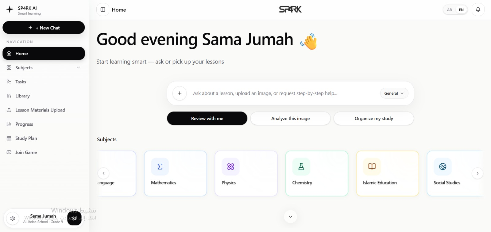
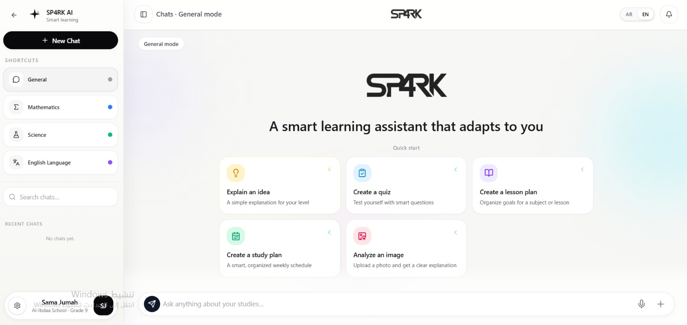

# 🎓 AI-Powered Educational Platform (Curriculum-Aware RAG System)

An intelligent educational platform that helps students understand and solve textbook exercises using curriculum-based reasoning.

This system is designed to **mimic how a teacher explains problems**, by retrieving relevant textbook content (lessons, examples, exercises) and generating step-by-step solutions based strictly on the curriculum.

---

## 📸 Demo

### 🏠 Main Page


### 💬 Chat Interface


---

## 🚀 Key Features

* 📚 **Curriculum-Aware AI**

  * Answers are generated only from textbook content (no hallucinations)

* 🔍 **Smart Retrieval System (RAG)**

  * Uses vector search (Qdrant) to find:

    * Lesson explanations
    * Solved examples
    * Exercises

* 🧠 **Example-Based Reasoning**

  * Matches each question with the most similar example
  * Solves problems using the same method

* 🧩 **Advanced Content Structuring**

  * Automatically detects:

    * Lessons
    * Examples
    * Exercises
  * Extracts:

    * Book page
    * Exercise number
    * Content type

* 🧑‍🏫 **Step-by-Step Solutions**

  * Clear explanations like a real teacher
  * Structured reasoning (analyze → match → solve)

* 🌐 **Bilingual Support (Arabic / English)**

* ⚡ **Admin Upload System**

  * Upload:

    * Lesson file
    * Examples file
    * Exercises file

---

## 🏗️ System Architecture

```text
User → Frontend (React)
        ↓
Backend (FastAPI)
        ↓
Query Parser → Vector Search (Qdrant)
        ↓
Retrieve:
    - Relevant Example
    - Exercise
    - Lesson
        ↓
LLM (DeepSeek / AI Model)
        ↓
Step-by-step Solution
```

---

## 🛠️ Tech Stack

### Frontend

* React (Vite)
* Modern UI Components
* RTL + Arabic Support

### Backend

* FastAPI
* Python

### AI & Retrieval

* DeepSeek (LLM)
* Qdrant (Vector Database)
* Embeddings-based search

---

## 📂 Project Structure

```text
frontend/
backend/
  ├── chunker.py
  ├── vector_db_service.py
  ├── query_parser.py
  ├── chat.py
  ├── ask.py
  ├── solve.py
  └── upload.py
```

---

## ⚙️ How It Works

### 1. Upload Content

Admin uploads:

* Lesson (theory)
* Examples (solutions)
* Exercises (questions)

### 2. Chunking & Structuring

The system automatically:

* Splits PDF into chunks
* Detects:

  * content_type (lesson / example / exercise)
  * exercise_label
  * book_page

### 3. Query Processing

User asks:

> Explain exercise 12 on page 414

System extracts:

* Exercise = 12
* Page = 414

### 4. Smart Retrieval

System retrieves:

* Matching exercise
* Closest example
* Related lesson

### 5. AI Reasoning

The AI:

* Analyzes the exercise
* Matches similar example
* Applies same solving method
* Generates structured explanation

---

## 🎯 Project Goals

* Build a trustworthy AI tutor
* Avoid hallucinations
* Provide curriculum-based explanations
* Improve student understanding (not just answers)

---

## ⚠️ Current Limitations

* Requires well-structured PDFs
* Example matching depends on embedding quality
* Some edge cases may require manual refinement

---

## 🔮 Future Improvements

* Better example matching using classification tags
* Smart difficulty detection
* Multi-step reasoning memory
* Performance optimization (faster responses)
* Improved UI/UX
* Multi-subject support

---

## 👨‍💻 Author

Developed by: **Mazen Fayez Jumah**
